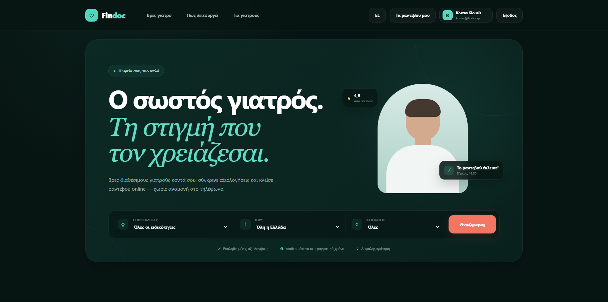
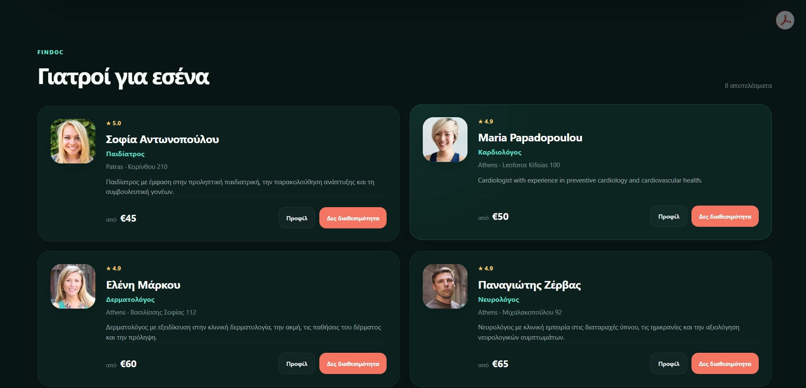
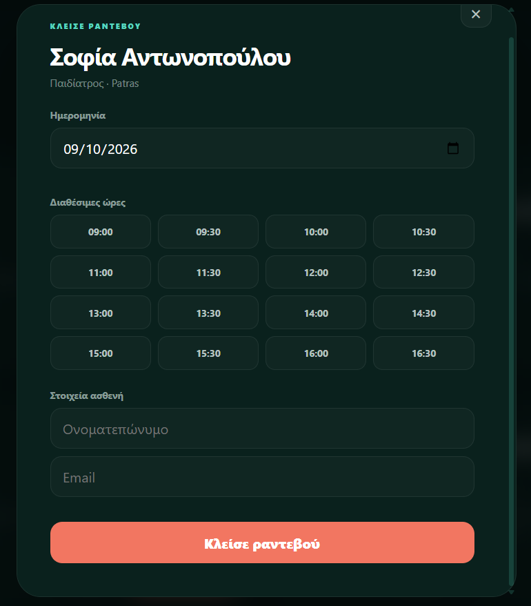
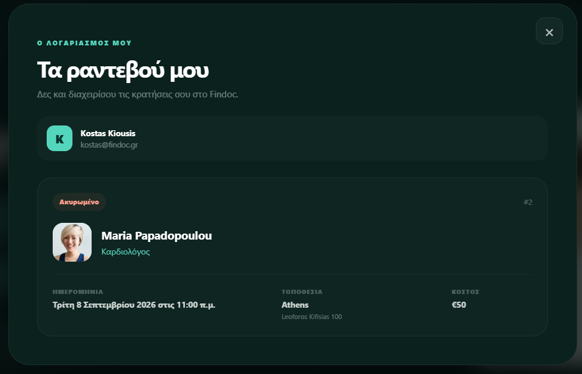

# Findoc

Findoc is a full-stack doctor discovery and appointment booking platform designed for the Greek healthcare market.

Users can search for doctors by specialty and location, view doctor profiles, check real-time appointment availability, book appointments, manage their bookings, and cancel upcoming appointments through a modern responsive interface.

The project was developed as a portfolio-ready full-stack application using **React, TypeScript, ASP.NET Core, Entity Framework Core, SQLite, and JWT Authentication**.

---

## Screenshots

### Home



### Doctor Search



### Appointment Booking



### My Appointments



---

## Features

### Doctor Discovery

- Search doctors by specialty
- Filter doctors by city
- Browse doctor profiles
- View doctor ratings
- View consultation prices
- View professional information and biography
- Responsive doctor result cards
- Dedicated doctor profile modal

### Appointment Booking

- Real-time appointment availability
- 30-minute appointment slots
- Weekday scheduling
- Prevention of double booking
- Appointment validation
- Booking confirmation
- Automatic release of cancelled appointment slots

### Authentication

- User registration
- User login
- JWT-based authentication
- Secure password hashing
- Persistent login session
- Protected API endpoints
- Authenticated patient account

### Patient Account

- View personal appointments
- View appointment status
- View doctor information
- View appointment date, location and price
- Cancel upcoming appointments
- Keep cancelled appointments visible in appointment history

### User Interface

- Responsive desktop and mobile design
- Dark health-tech visual identity
- Minimal premium interface
- Mobile-optimized navigation
- Doctor profile modal
- Appointment booking modal
- Authentication modal
- Appointment management interface
- Responsive doctor cards
- Premium dark green, mint and coral design system

---

## Tech Stack

### Frontend

- React
- TypeScript
- Vite
- CSS
- Fetch API
- Local Storage

### Backend

- ASP.NET Core
- .NET 10
- Minimal APIs
- Entity Framework Core
- JWT Bearer Authentication
- ASP.NET Core PasswordHasher

### Database

- SQLite
- Entity Framework Core Migrations

---

## Project Structure

```text
Findoc
│
├── Findoc.Api
│   ├── Data
│   │   └── FindocDbContext.cs
│   │
│   ├── Migrations
│   │
│   ├── Models
│   │   ├── ApplicationUser.cs
│   │   ├── Appointment.cs
│   │   └── Doctor.cs
│   │
│   ├── Properties
│   ├── Program.cs
│   ├── appsettings.json
│   └── Findoc.Api.csproj
│
├── findoc-client
│   ├── public
│   │
│   ├── src
│   │   ├── assets
│   │   ├── App.css
│   │   ├── App.tsx
│   │   ├── index.css
│   │   └── main.tsx
│   │
│   ├── package.json
│   ├── package-lock.json
│   └── vite.config.ts
│
├── docs
│   └── screenshots
│       ├── 01-home.png
│       ├── 02-doctors.png
│       ├── 03-booking.png
│       └── 04-appointments.png
│
├── .gitignore
├── README.md
└── Findoc.slnx
```

---

## API Endpoints

### Authentication

```http
POST /api/auth/register
POST /api/auth/login
GET  /api/auth/me
```

### Doctors

```http
GET    /api/doctors
GET    /api/doctors/{id}
POST   /api/doctors
DELETE /api/doctors/{id}
```

### Specialties

```http
GET /api/specialties
```

### Availability

```http
GET /api/doctors/{id}/availability?date=YYYY-MM-DD
```

### Appointments

```http
POST  /api/appointments
GET   /api/appointments/my
GET   /api/appointments/{id}
PATCH /api/appointments/{id}/cancel
```

---

## Local Development

### Requirements

Make sure the following are installed:

- .NET 10 SDK
- Node.js
- npm
- Git

---

## Backend Setup

Open a terminal inside the project:

```powershell
cd Findoc.Api
dotnet restore
dotnet ef database update
dotnet run
```

The API runs by default at:

```text
http://localhost:5087
```

---

## Frontend Setup

Open a second terminal:

```powershell
cd findoc-client
npm install
npm run dev
```

On Windows PowerShell, if the npm execution policy blocks `npm`, use:

```powershell
npm.cmd install
npm.cmd run dev
```

Open the local Vite URL displayed in the terminal.

---

## JWT Configuration

The JWT signing key is intentionally **not stored in the repository**.

For local development, configure it with .NET User Secrets.

From the backend directory:

```powershell
cd Findoc.Api
dotnet user-secrets init
dotnet user-secrets set "Jwt:Key" "YOUR-DEVELOPMENT-JWT-KEY"
```

The public JWT configuration stored in `appsettings.json` contains only:

```json
{
  "Jwt": {
    "Issuer": "Findoc.Api",
    "Audience": "Findoc.Client"
  }
}
```

The signing key should remain outside source control.

---

## Database

Findoc uses **SQLite** for local development.

The database schema is managed using Entity Framework Core migrations.

Apply all existing migrations with:

```powershell
cd Findoc.Api
dotnet ef database update
```

The local database file is excluded from Git through `.gitignore`.

---

## Appointment Availability

The current appointment system includes:

- Monday-Friday availability
- 30-minute appointment slots
- Working hours from 09:00 to 17:00
- Past-date validation
- Weekend validation
- Double-booking protection
- Automatic reopening of cancelled appointment slots

---

## Demo Data

The development version includes fictional doctor profiles across multiple specialties and Greek cities.

### Specialties

- Cardiologist
- Dermatologist
- Neurologist
- Pediatrician
- Orthopedic Doctor

### Cities

- Athens
- Thessaloniki
- Patras
- Ioannina

All doctor profiles and patient-facing demo data are used only for development and portfolio demonstration purposes.

---

## Security

The application currently implements:

- Password hashing
- JWT authentication
- Protected patient endpoints
- Appointment ownership validation
- Unique doctor/time appointment constraints
- Local secret management with .NET User Secrets
- Credential exclusions through `.gitignore`
- SQLite database exclusion from source control
- Authorization checks for appointment cancellation

---

## Current Patient Flow

Findoc currently supports the complete core patient journey:

1. Create an account
2. Sign in
3. Search for a doctor
4. Filter doctors by specialty and city
5. View a doctor's profile
6. Check appointment availability
7. Select a date and time
8. Book an appointment
9. View personal appointments
10. Cancel an upcoming appointment
11. Reuse a cancelled appointment slot

---

## Insurance Filter

The current interface includes an insurance selector for UI demonstration.

Backend insurance-provider filtering is planned for a future version.

---

## Planned Improvements

Future improvements may include:

- Doctor dashboard
- Doctor registration and onboarding
- Doctor authentication
- Real insurance provider support
- Appointment rescheduling
- Email notifications
- SMS notifications
- Patient reviews and ratings
- Advanced doctor search
- Map-based doctor discovery
- Admin dashboard
- Doctor availability management
- Cloud deployment
- PostgreSQL production database
- Online payments
- Multi-language support

---

## Project Goals

Findoc was created to demonstrate practical full-stack development skills including:

- REST API design
- Authentication and authorization
- Relational database modeling
- Entity Framework Core
- React application development
- TypeScript
- Responsive UI/UX
- API integration
- State management
- Healthcare appointment workflows
- Secure secret management
- Git and GitHub workflow

---

## Repository

This repository contains both the frontend and backend source code for Findoc.

- Frontend: React + TypeScript
- Backend: ASP.NET Core
- Database: SQLite
- Authentication: JWT

---

## Disclaimer

Findoc is a portfolio and educational project.

The doctors, profiles, appointments and related healthcare information displayed in the demo are fictional and are not intended to represent real medical professionals or real healthcare services.

---

## License

This project is intended for educational and portfolio purposes.